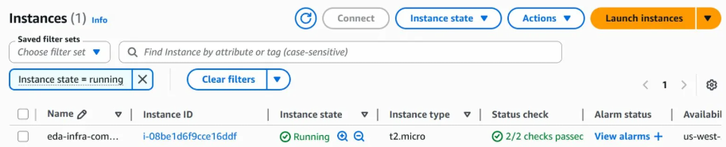

# AWS EDA Infrastructure (Terraform)

Infrastructure-as-code configuration that provisions a ready-to-use EDA (Electronic Design Automation) simulation environment on AWS. A single `terraform apply` stands up a compute node pre-loaded with circuit simulation tools (ngspice), a secure S3 bucket for storing simulation results, and the IAM permissions connecting them.

Built to demonstrate how infrastructure-as-code can automate the provisioning of engineering compute environments, the kind of work an EDA infrastructure team does daily.

## Architecture
```
+-----------------------------------------------------+
|  VPC (10.0.0.0/16)                                  |
|                                                     |
|  +----------------------+  +----------------------+ |
|  |  Public Subnet       |  |  Private Subnet      | |
|  |  10.0.1.0/24         |  |  10.0.2.0/24         | |
|  |                      |  |                      | |
|  |  +----------------+  |  |  (reserved for       | |
|  |  | EC2 Compute    |  |  |   internal services) | |
|  |  | Node (t2.micro)|  |  |                      | |
|  |  |                |  |  |                      | |
|  |  | - ngspice      |  |  |                      | |
|  |  | - Python 3     |  |  |                      | |
|  |  | - AWS CLI      |  |  |                      | |
|  |  +-------+--------+  |  |                      | |
|  +----------|------------+  +----------------------+ |
|             |                                       |
|  +----------v-----------+                            |
|  |  Internet Gateway    |                            |
|  +----------------------+                            |
|                                                     |
|  +----------------------+                            |
|  |  S3 Bucket           |   <-- simulation results  |
|  |  (encrypted, version |       uploaded via IAM     |
|  |   controlled, no     |       instance role        |
|  |   public access)     |                            |
|  +----------------------+                            |
+-----------------------------------------------------+
```

## What This Provisions

| Resource | Purpose |
|----------|---------|
| **VPC** | Isolated network with DNS support |
| **Public Subnet** | Hosts compute node with internet access |
| **Private Subnet** | Reserved for internal-only resources |
| **Internet Gateway + Route Table** | Routes public subnet traffic to the internet |
| **Security Group** | Firewall restricting SSH to a single IP (CIDR /32) |
| **EC2 Instance** | Ubuntu 24.04 compute node with ngspice, Python 3, and AWS CLI pre-installed |
| **S3 Bucket** | Artifact storage with AES-256 encryption, versioning, and all public access blocked |
| **IAM Role + Policy** | Grants EC2 instance scoped write access to the S3 bucket (least-privilege) |

## How It Works

1. `terraform apply` creates all infrastructure
2. The EC2 instance boots and runs `user_data.sh`, which installs ngspice, Python, and AWS CLI
3. Engineers SSH in, run SPICE simulations, and use the included `run_and_upload.sh` helper to push results to S3
4. `terraform destroy` tears everything down cleanly

The included helper script at `/opt/eda/scripts/run_and_upload.sh` automates the simulate-and-store workflow:
```bash
# On the EC2 instance:
/opt/eda/scripts/run_and_upload.sh my_circuit.spice eda-infra-artifacts-a1b2c3d4
# Runs ngspice simulation, uploads results to S3 with timestamp
```

## Security Considerations

- SSH access is restricted to a single IP address via /32 CIDR block
- S3 bucket enforces server-side encryption (AES-256)
- S3 public access is fully blocked (ACLs + policies)
- Bucket versioning is enabled for artifact integrity
- IAM role follows least-privilege: EC2 can only read/write to its own S3 bucket
- Sensitive values (terraform.tfvars) are excluded from version control

## Usage

### Prerequisites
- [Terraform](https://developer.hashicorp.com/terraform/install) >= 1.0
- [AWS CLI](https://aws.amazon.com/cli/) configured with valid credentials
- An AWS account with permissions to create VPC, EC2, S3, and IAM resources

### Deploy
```bash
# Clone the repo
git clone https://github.com/Maaz679/aws-eda-infra.git
cd aws-eda-infra

# Create your variables file
cp terraform.tfvars.example terraform.tfvars
# Edit terraform.tfvars with your values

# Initialize, preview, and deploy
terraform init
terraform plan
terraform apply
```

### Tear Down
```bash
terraform destroy
```

## Deployment Verification

Successfully deployed and verified on AWS (us-west-2):



## Project Structure
```
aws-eda-infra/
├── main.tf              # Core infrastructure definitions (VPC, EC2, S3, IAM)
├── variables.tf         # Input variable declarations
├── outputs.tf           # Output values displayed after deploy
├── user_data.sh         # EC2 bootstrap script (installs ngspice, Python, AWS CLI)
├── terraform.tfvars.example  # Example variable values (safe to commit)
├── .gitignore           # Excludes state files and secrets
└── README.md
```

## Technologies

- **Terraform** - Infrastructure as Code
- **AWS VPC** - Network isolation
- **AWS EC2** - Compute (with automated provisioning via user_data)
- **AWS S3** - Encrypted object storage for simulation results
- **AWS IAM** - Least-privilege access control
- **ngspice** - Open-source SPICE circuit simulator
